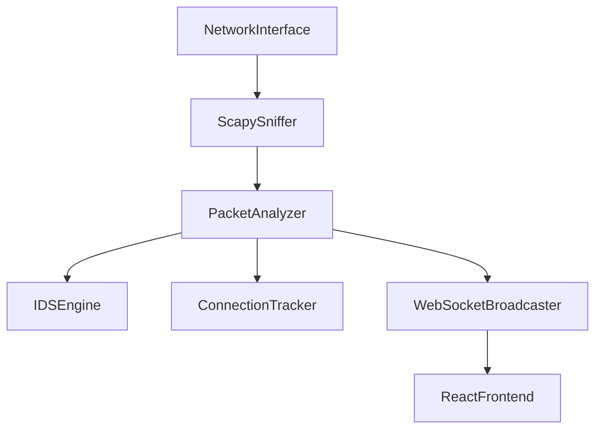

# HexSniff Architecture

HexSniff is divided into a high-performance Python (FastAPI + Scapy) backend and a React (Vite + Three.js) frontend.

## 1. Packet Pipeline

- **ScapySniffer:** Binds to the local NIC using Npcap (Windows) or libpcap (Linux). Runs in a dedicated background thread.
- **PacketAnalyzer:** Enriches raw bytes into structured JSON. Extracts MAC, IP, Ports, TCP Flags, HTTP Hosts, and DNS Queries. Applies MaxMind GeoIP resolution via an LRU Cache to eliminate disk blocking.
- **ConnectionTracker:** Tracks TCP SYN floods and Port Scans using an **O(1)** hash map algorithm, preventing exponential CPU spikes under heavy DDoS loads.

## 2. Threat Intel Pipeline
- **IDSEngine:** Loads dynamic feeds (URLhaus, Feodo Tracker) from disk.
- Converts lists of IOCs into strictly segmented `set` and `dict` lookups (`ioc_ips`, `ioc_domains`).
- Ensures that matching millions of packets against thousands of IOCs executes in O(1) time complexity.

## 3. MITRE ATT&CK Pipeline & Coverage Engine
- The **Coverage Engine** maps all triggered alerts to the official MITRE ATT&CK framework (e.g., T1083 Path Traversal).
- Alerts are streamed directly to the frontend, updating the live MITRE dashboard.

## 4. Replay & Validation Engine
- Offline PCAP files uploaded via the UI bypass the live NIC.
- They are processed through the `analyzer.py` engine either immediately (Validation Lab) or with simulated time delays (Replay Engine).
- The Validation engine generates forensic scoring, rolling up packet evidence into consolidated, high-confidence detection reports.

## 5. Case Management Pipeline
- Powered by a local SQLite database operating in **Write-Ahead-Logging (WAL)** mode.
- Analysts can persist investigation state across sessions.
- Allows attaching specific Network Packet IDs or Alert IDs as evidence to an open case via the REST API.

## 6. AI Pipeline
- An on-demand service.
- When invoked by an analyst, it packages the most recent IDS alerts and packet samples into a dense, evidence-driven prompt.
- Sent via REST to the Google Gemini API (or local Ollama).
- Returns Markdown-formatted executive summaries and SOC recommendations.
